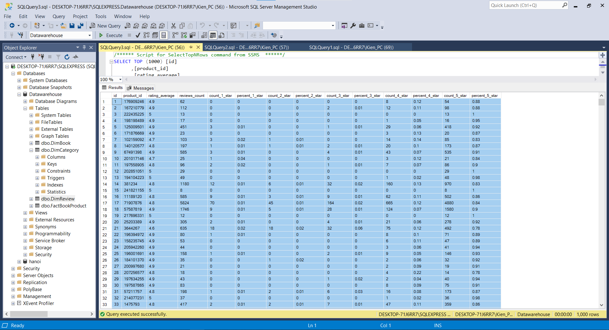

# Product pipeline with Airflow

> A ETL data pipeline with Airflow, PostgreSQL, Docker, SQL server

## Project Overview

### Description

The objective of this project is to create an efficient ETL pipeline capable of extracting book-related information from TIKI, an ecommerce platform. The extracted data will be transformed and loaded into a data warehouse, where it will be stored as a reliable data source. This data source can then be used to seamlessly integrate with various BI tools, enabling deeper insights into the book products available on ecommerce platforms. 

### Problem statement

The first step in this project is to extract book product data from an online ecommerce website in JSON format. This data will be crawled and stored in `PostgreSQL`, which will serve as the staging database. Next, Python with Pandas library will be used to process the data, handling missing values and formatting it to improve its readability. The final stage involves loading the processed data into `SQL server`.To ensure smooth and efficient data ingestion, the entire process will be automated using the `Airflow` process automation tool.

### Tech Stacks
- OS: `Window 10 Version 22H2`
- Containerization: `Docker 20.10.22`
- Automate Data Pipelines: `Airflow 2.5.0`
- Staging Database: `PostgreSQL 15.1`
- Data Warehouse: `SQL server`
- Language: `Python 3.10.6`

### Data Platform Architecture
<p align="center">
    
</p>

## Implementation 

### Database schema design

Using star schema

**1. Staging Tables**
- staging.book_product_id
    ```
    product_id
    ```  
    
- staging.book_product_data
    ```
    product_id 
    name 
    sku 
    price 
    original_price 
    discount 
    discount_rate 
    image_url 
    author 
    quantity_sold 
    publisher 
    manufacturer 
    number_of_pages 
    translator 
    publication_date 
    book_cover 
    width 
    height 
    category 
    category_id
    ```
- staging.book_product_review
    ```
    product_id 
    rating_average
    reviews_count
    count_1_star
    percent_1_star
    count_2_star
    percent_2_star
    count_3_star
    percent_3_star
    count_4_star
    percent_4_star
    count_5_star
    percent_5_star
    ```

**2. Fact Table**
- factbookproduct

**3. Dimension Tables**
- dimbook

- dimcategory

- dimreview

<p align="center">
    
</p>
 

### Data pipeline
The graph view for of data pipeline displayed below describe the task dependencies and the workflow of ETL process:
<p align="center">
    
</p>

### Report Dashboard

The data stored in the data warehouse is utilized in creating a simple Power BI dashboard, as illustrated in the image.

<p align="center">
    
</p>

### Some screenshots
<p align="center">
    <p>ProductId Staging Table</p>
    
</p>
<p align="center">
    <p>ProductData Staging Table</p>
    
</p>
<p align="center">
    <p>ProductReview Staging Table</p>
    
</p>
<p align="center">
    <p>FactBookProduct Table</p>
    
</p>
<p align="center">
    <p>DimBook Table</p>
    
</p>
<p align="center">
    <p>DimCategory Table</p>
    
</p>
<p align="center">
    <p>DimReview Table</p>
    
</p>
